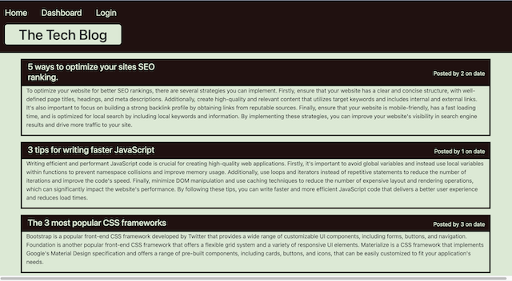
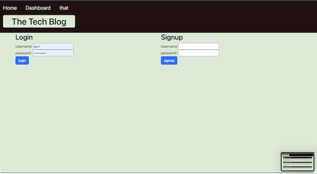

# Tech-blog

  

  ## Description:
        
  An application that allows to you read tech blogs published by other users and to create your own blog post to share.
    
  ---
  
  ## Table of Contents:
    
  - [Instillation](#instillation)
  - [Usage](#usage)
  - [Credits](#credits)
  - [License](#license)
  - [Questions](#questions)
  
  ## Instillation:
  
  Please intall be cloning the code to your personal machine to run in a code editor. Project will soon be deployed with heroku to view as well.
  
  ## Usage:
  
  Learn about tech through reading blogs and post your own blogs to share the knowledge that you have gained with others too.
  
  ## ScreenShots:
  

  
  ## Credits:
  Thirdparty-assets:
  - Node.js
  - Express
  - Inquirer
  
  
  
  ## License:
  
  This project uses the [MIT](https://opensource.org/licenses/MIT) license.

  ## Tests:

  ---
  
  ## Questions:

  Please feel free to get in contact if you have any questions about this project.

  - Github: [Jamesgit22](https://github.com/Jamesgit22)
  - Email: jamesschroedermail97@gmail.com